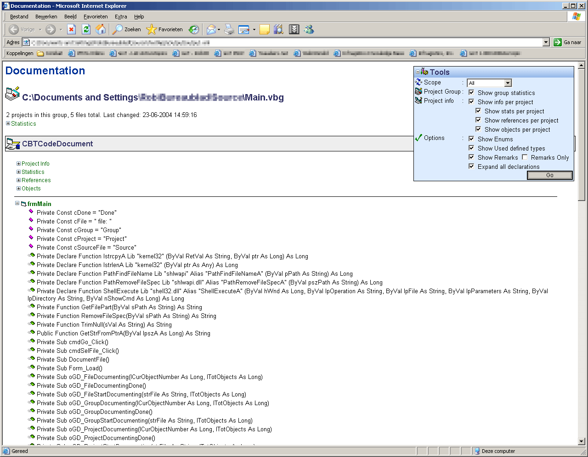



## Code Documenter 1\.0\.5

### Description

An application that documents VB5/6 code. Outputs an XML file, which is then transformed with an XSLT into a cool documentation file.

It documents properties, methods, events and even show statistics about your project, references that are used and so on. It really generates a complete overview of your project.

It handles Visual Basic Group files, Project files, modules, forms, classes and is very easy to use (just select the file you want to document and hit the button). It even extract's "TODO","BUG","IDEA" and other 'tags' you might use in your code.

The output is completely configurable with a toolwindow that allows you to filter public/private methods, but also enables you to quickly expand all collapsed nodes in the view and much, much more.

Open Main.vbg and just hit F5 to run the project. Select a visual basic file and see how great it documents. All those expensive commercial tools can now be sent to your trashcan. This is the only tool you'll ever need to document your code.

See screenshot for an example of the output. **NEW** Version 1.0.4 now also recognizes usercontrols, property pages and designer files.
 
### More Info
 
VBScript 5 and MSXML have to be installed.

             |
---                |---
**Submitted On**   |2004-11-04 16:02:22
**By**             |[RobIII](https://github.com/Planet-Source-Code/PSCIndex/blob/master/ByAuthor/robiii.md)
**Level**          |Advanced
**User Rating**    |5.0 (210 globes from 42 users)
**Compatibility**  |VB 5\.0, VB 6\.0
**Category**       |[Complete Applications](https://github.com/Planet-Source-Code/PSCIndex/blob/master/ByCategory/complete-applications__1-27.md)
**World**          |[Visual Basic](https://github.com/Planet-Source-Code/PSCIndex/blob/master/ByWorld/visual-basic.md)
**Archive File**   |[Code\_Docum18204711202004\.zip](https://github.com/Planet-Source-Code/robiii-code-documenter-1-0-5__1-57091/archive/master.zip)

